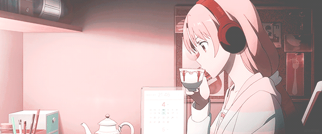

👩🏼‍💻 Cursando Análise e Desenvolvimento de Sistemas 🎯  🎓  Formada em Letras 📚

##

  

##

 

 
 
   
 

 

 
  

 

##

              
<picture>
  <source media="(prefers-color-scheme: dark)" srcset="github-user-contribution.svg" />
  <source media="(prefers-color-scheme: light)" srcset="github-user-contribution.svg" />
  
</picture>
